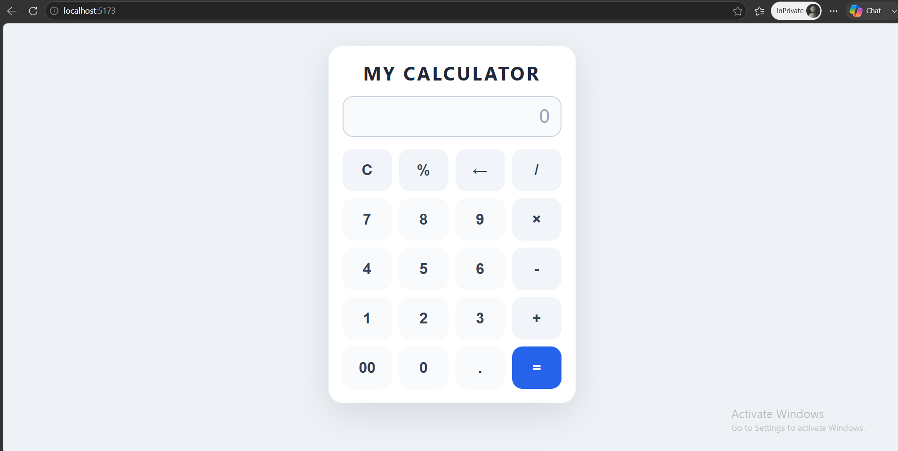

# Calculator


A polished responsive calculator app built with HTML, CSS, and JavaScript. The project runs locally with Vite and is deployed on GitHub Pages.

## Demo

- Live demo: https://jayrhuuu.github.io/calculator/

## Features

- Responsive calculator layout for desktop and mobile devices
- Keyboard input support for numbers and operators
- Percentage calculation and clear/backspace handling
- Smart operator and decimal validation
- Clean event delegation for button clicks
- GitHub Pages friendly relative asset paths

## Technologies Used

- HTML5
- CSS3
- JavaScript (ES6+)
- Vite (development server)
- GitHub Pages

## Installation

```powershell
npm install
```

## Usage

Start the local development server:

```powershell
npm run dev
```

Then open the URL shown by Vite, usually `http://localhost:5173`.

For a quick preview, open `index.html` directly in your browser.

## Project Structure

```text
calculator/
├── index.html
├── style.css
├── script.js
├── favicon.ico
├── package.json
├── .gitignore
└── README.md
```

## Screenshots



## Future Enhancements

- Add history logging for previous calculations
- Add theme switching (light/dark mode)
- Support advanced operations like square root and exponentiation
- Add touch feedback animations and sound effects
- Add unit tests and GitHub Actions for continuous integration

## Author

JayRhuuu

## License

This project is licensed under the MIT License.

## Contribution

1. Fork the repository.
2. Create your feature branch: `git checkout -b feature-name`
3. Commit your changes: `git commit -m "Add some feature"`
4. Push to the branch: `git push origin feature-name`
5. Open a pull request.

Please keep changes small and focused, and include a clear description of your work.
